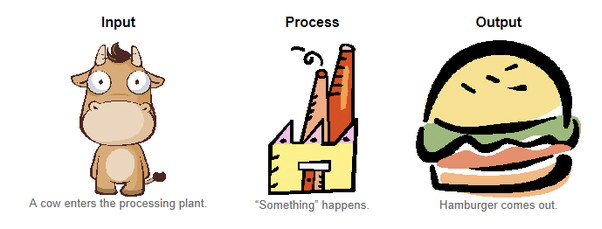
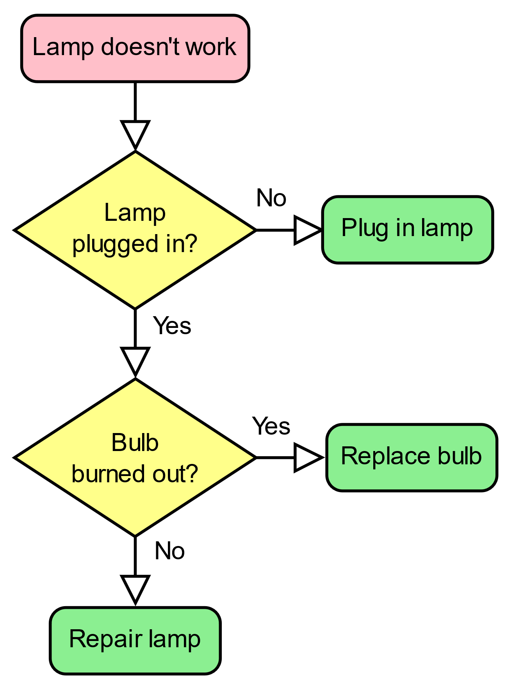
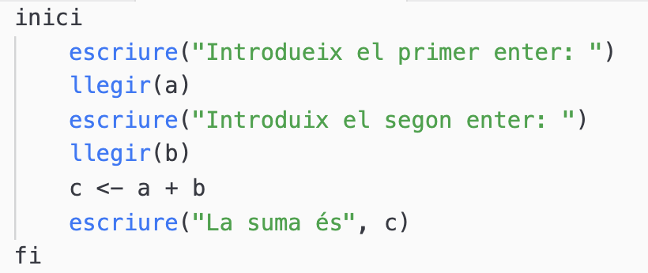
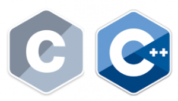
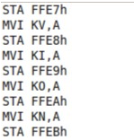
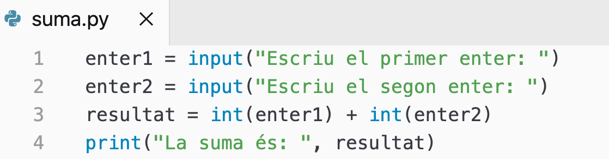
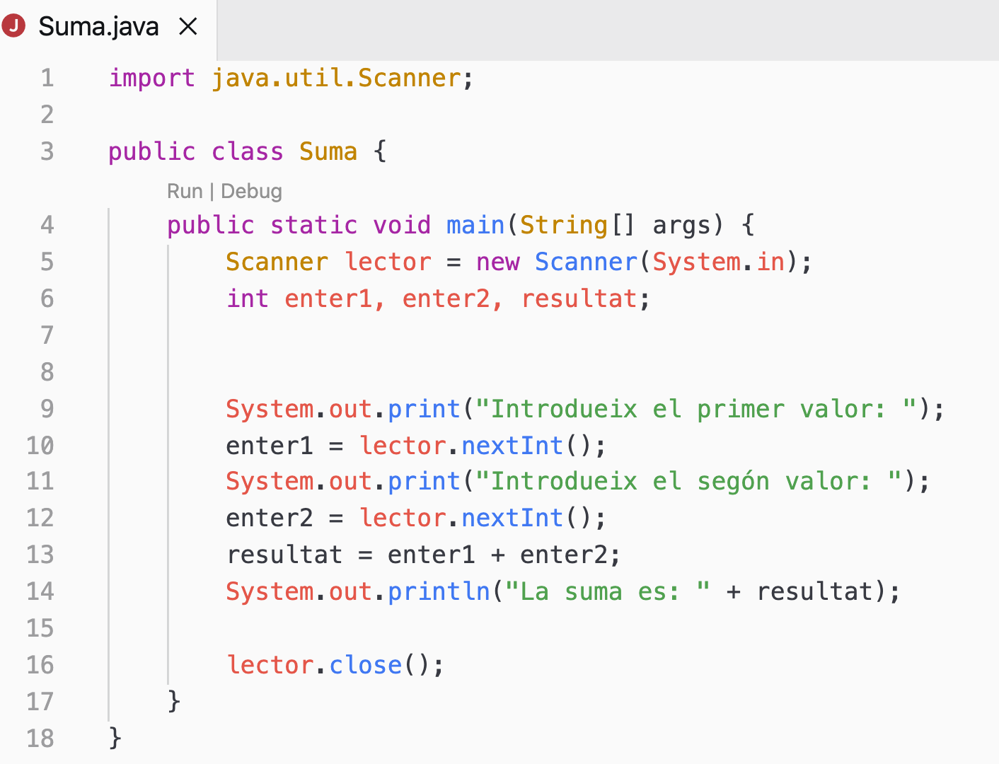
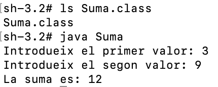
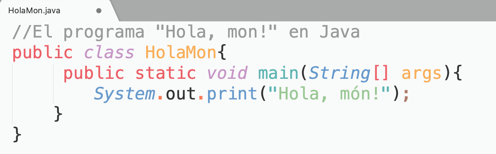

# Índex de continguts

- [UT1.1 Estructura bàsica d'un programa informàtic](#ut11-estructura-bàsica-dun-programa-informàtic)
- [Iniciació a la programació](#iniciació-a-la-programació)
- [Algorismes i programes](#algorismes-i-programes)
- [Exemple: programa d'un robot de cuina](#exemple-programa-dun-robot-de-cuina)
- [Faena del programador](#faena-del-programador)
- [Tipus d'ordres que un ordinador accepta](#tipus-dordres-que-un-ordinador-accepta)
- [Comparativa: Ordinador vs Pizzeria](#comparativa-ordinador-vs-pizzeria)
- [Multiplicar dos nombres (llenguatge natural)](#multiplicar-dos-nombres-llenguatge-natural)
- [Disseny de l'algorisme](#disseny-de-lalgorisme)
- [Llenguatges de programació](#llenguatges-de-programació)
- [Exemple de programa](#exemple-de-programa)
- [Errors de compilació](#errors-de-compilació)
- [Llenguatge natural vs Llenguatge de programació](#llenguatge-natural-vs-llenguatge-de-programació)
- [Entorns integrats de desenvolupament (IDE)](#entorns-integrats-de-desenvolupament-ide)
- [Abans de començar el teu primer programa](#abans-de-començar-el-teu-primer-programa)
- [Creació i execució de programes](#creació-i-execució-de-programes)
- [Compilador i intèrpret](#compilador-i-intèrpret)
- [Compilació i execució](#compilació-i-execució)
- [Multiplataforma](#multiplataforma)
- [Estructura HolaMon](#estructura-holamon)
- [Pràctiques](#pràctiques)

---

## UT1.1 Estructura bàsica d'un programa informàtic

Aquest apartat introdueix els conceptes bàsics de l'estructura d'un programa informàtic en el context de la programació.

---

## Iniciació a la programació

La programació està present en moltes de les nostres accions diàries, encara que no sempre en siguem conscients.


---

## Algorismes i programes

### Algorisme
Un **algorisme** és la seqüència ordenada de passos, descrita sense ambigüitats, que condueixen a la solució d'un problema donat.

- No té perquè estar relacionat amb els ordinadors, per exemple preparar una recepta.
- La resolució del problema parteix d'unes dades d'entrada, una seqüència de passos o instruccions i unes dades d'eixida.



### Programa
En un **programa**, els passos que permeten resoldre el problema s'han d'escriure en un determinat llenguatge de programació perquè puguen ser executats en l'ordinador i així obtindre la solució.

### Característiques dels algorismes
- Han de ser precisos i indicar l'ordre de realització pas a pas.
- Han d'estar definits. Si s'executen dos o més vegades, han d'obtindre el mateix resultat cada vegada.
- Han de ser finits, han de tenir un nombre finit de passos.

---

## Exemple: programa d'un robot de cuina

Recepta: crema de panís

1. Detectar que al robot hi haja farina de panís i mantega
2. Remoure durant 1 minut, incrementant la velocitat progressivament de l'1 al 5
3. Detectar que al robot hi haja llet i sal 
4. Remoure durant 30 segons a velocitat 7
5. Remoure durant 10 minuts a velocitat 3 amb temperatura de 90 ºC
6. Parar el robot. La crema ja està preparada.

---

## Faena del programador

Per automatitzar, el programador haurà de triar:

- Quines ordres 
- En quin ordre
- Sobre quines dades

La complexitat depèn de les tasques. És important recordar que l'ordinador no ho fa tot sol.

**Nota**: Eficàcia i eficiència són conceptes distints.

---

## Tipus d'ordres que un ordinador accepta

Les ordres estan limitades per les capacitats dels components. (Ex: Una rentadora no pot gratinar)

Cada ordre està vinculada a aquestes tres parts de l'ordinador:

1. **Processador**: gestionar ordres de manipulació i transformació de les dades.
2. **Memòria**: emmagatzema les dades que el processador utilitzarà o ha processat. (RAM o ROM)
3. **E/S**: intercanvi de dades amb l'exterior (teclat, monitor, etc.)

---

## Comparativa: Ordinador vs Pizzeria

- Cuiner manipula ingredients (processador)
- Frigorífic emmagatzema ingredients (Memòria) 
- Motorista, cambrer, telèfon (E/S)
- Recepta (Programa)

---

## Multiplicar dos nombres (llenguatge natural)

| Ordre | Element que ho realitza |
|-------|--------------------------|
| Llegir un nombre per teclat | E/S (Teclat) |
| Guardar el nombre en memòria | Memòria |
| Llegir un nombre per teclat | E/S (Teclat) |
| Guardar el nombre en memòria | Memòria |
| Recuperar els dos nombres guardats i realitzar l'operació | Processador |
| Guardar el resultat a la memòria | Memòria |
| Mostrar el resultat | E/S (Pantalla) |

---

## Disseny de l'algorisme

Podem dissenyar algoritmes de forma genèrica utilitzant pseudocodi o bé mitjançant un organigrama o diagrama de flux.




---

## Llenguatges de programació

- Llenguatge artificial dissenyat per a crear algoritmes que puguen ser utilitzats per un ordinador
- Multitud de llenguatges, cadascun amb la seua sintaxi (similar als idiomes)
- Les ordres seran instruccions
- Les instruccions s'emmagatzemen en fitxers

### Classificació dels llenguatges

Segons les característiques es classifiquen en:

1. **Llenguatge compilat o interpretat** (passos que segueix per obtindre un executable)
2. **Llenguatge d'alt o baix nivell** (llunyania o proximitat amb el llenguatge màquina que un ordinador entén)

### Llenguatges compilats

- En la compilació es tradueix tot el codi (codi font) a un llenguatge que la màquina entenga (llenguatge màquina) i per això solen ser més ràpids.
- Es crea un arxiu executable.
- L'arxiu executable no serà multiplataforma.
- En cas d'existir un error en el codi, el compilador ho farà saber (i no es compilarà el programa).



### Llenguatges interpretats

- Són multiplataforma, per això són més portables però es requereix d'un intèrpret.
- Es tradueix cada línia de codi de forma ordenada cada volta que s'executa (no es genera un fitxer executable).


### Java: un cas particular

Java és un llenguatge compilat, però és compilat a un llenguatge intermedi anomenat bytecode, que després és interpretat.

- Per executar codi Java cal instal·lar el JRE (Java Runtime Environment).
- Per a compilar codi Java necessites el JDK (Java Development Kit).

### Llenguatges de baix nivell

1. **Llenguatge màquina**: Instruccions en binari, octal o hexadecimal. Cada microprocessador té el seu propi llenguatge màquina.
2. **Llenguatge assemblador**: Proper al llenguatge màquina. Substitueix el codi binari per operacions simples (ADD, INC, DEC, MOV...). Ha de ser traduït (assemblat) a codi màquina.




### Llenguatges d'alt nivell


- Especificació d'una gramàtica més similar al llenguatge natural, el que facilita al programador crear programes complexos.
- L'ordinador haurà de traduir cada instrucció o estructura del llenguatge de programació en una seqüència molt més llarga d'instruccions en codi màquina.
- Existeix gran varietat: C, C++, C#, Basic, Pascal, Ada, Clipper, COBOL, Delphi, Fortran, FoxPro, Java, JavaScript, Python, Ruby, Logo, PHP, Swift, Scratch...
- Cada llenguatge no és ni millor ni pitjor que un altre. Moltes voltes estan pensats per resoldre un tipus concret de problema o per cert àmbit.

---

## Exemple de programa



NOTA: No et preocupes si no entens el codi. No cal que el comprengues ni que el proves. Es posen els següents exemples per a fer una comparativa visual del mateix programa en distints llenguatges de programació.



---

## Errors de compilació

- Errors de sintaxi en el codi font
- Impossible de tractar pel compilador
- Normalment, s'avisa el programador d'on està l'error
- Un programa sense errors de compilació NO ASSEGURA que realitze correctament la seua missió.

---

## Llenguatge natural vs Llenguatge de programació

- Frase "vull ich helado un" (Impossible d'entendre)
- Frase "el gelat condueix un full de paper" (gramaticalment correcta però no té cap sentit)
- Els llenguatges de programació reaccionen igual (tenen la seua sintaxi i la seua semàntica)

---

## Entorns integrats de desenvolupament (IDE)

Desenvolupament i execució de programes: Editor i Compilador (inclou Linker) o Intèrpret.

Un IDE facilita la tasca i inclou ambdues eines.


---

## Abans de començar el teu primer programa

Decidir quin llenguatge utilitzem:
- Java, C++, JavaScript, Python?

Aprendre a programar en un llenguatge concret facilita l'aprenentatge d'altres.

El llenguatge en este curs serà Java.


---

## Creació i execució de programes

Ferramentes necessàries:
- Editor de text (Notepad, xed…)
- Compilador de llenguatge
- Intèrpret de Java

El fitxer creat ha de tindre extensió .java 

El nom del fitxer segueix una notació "camell" en concret UpperCamelCase (ex: Prova.java, HolaMon.java)

---

## Compilador i intèrpret

- Baixada gratuïta del JDK (Baixa l'última versió LTS)
- JDK conté tant el compilador com l'intèrpret

---

## Compilació i execució

El programa que compila és "javac"
- Exemple, en línia de comandaments:
  ```
  javac HolaMon.java
  ```
  → genera un fitxer anomenat HolaMon.class (conté el bytecode)

El programa que executa el bytecode generat és "java"
- Exemple, en línia de comandaments:
  ```
  java HolaMon
  ```
  Fixa't que la instrucció anterior no inclou l'extensió ".class"

Vídeo amb exemple d'instal·lació del JDK i prova de compilació: https://www.youtube.com/watch?v=_MoDtNIiZAQ

---

## Multiplataforma

Si solament necessites executar un programa Java, només caldrà tindre instal·lada la JVM (això es troba a la JRE)



Això vol dir que si agafes un fitxer ".class" prèviament generat i el descarregues en un altre ordinador que només tinga el JRE (habitualment vindrà instal·lat) funcionarà correctament el programa.

---

## Estructura HolaMon



1. Delimitació del codi font Java
2. Comentari del codi
3. Bloc de codi: mètode principal
4. Primera instrucció

---

## Pràctiques

### Pràctica 1

Copia el codi font del programa HolaMon.java i executa'l mitjançant línia d'ordres. El resultat per pantalla hauria ser la frase "Hola Món!"

Respecta les lletres majúscules i minúscules. Java és sensible a elles.

RECORDA: És important que realitzes aquestes pràctiques, faces proves i anotes qualsevol problema per a preguntar al professor.

### Pràctica 2

Modifica el codi font perquè el programa escriga ara "Adeu Món!"
