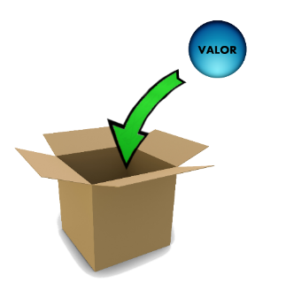
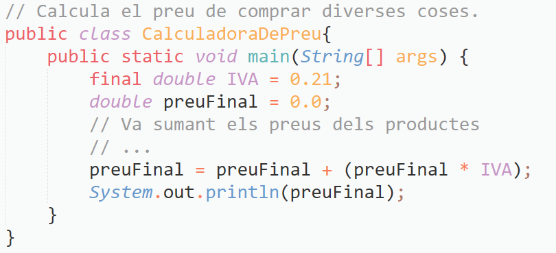

# Índex de continguts

- [UT1.3 Variables](#ut13-variables)
- [Ús de variables](#ús-de-variables)
  - [Només usem literals?](#només-usem-literals)
  - [Funcionament de la memòria](#funcionament-de-la-memòria)
  - [Declaració de variables](#declaració-de-variables)
  - [Identificador (nom de variable)](#identificador-nom-de-variable)
  - [Paraules reservades](#paraules-reservades)
  - [Exemples i pràctiques](#exemples-i-pràctiques)
- [Operacions amb variables](#operacions-amb-variables)
- [Constants](#constants)
- [Conversions de tipus](#conversions-de-tipus)
  - [Implícites](#conversions-de-tipus-implícites)
  - [Explícites](#conversions-de-tipus-explícites)
- [Eixida de dades per pantalla](#eixida-de-dades-per-pantalla)
- [Cadenes de text (String)](#cadenes-de-text-string)
- [Entrada simple de dades per teclat](#entrada-simple-de-dades-per-teclat-classe-scanner)
- [Comentaris](#comentaris)
  - [Comentari tradicional](#comentari-tradicional)
  - [Comentari d'una sola línia](#comentari-duna-sola-línia)
  - [Comentari de documentació](#comentari-de-documentació)

---

## UT1.3 Variables

Aquest tema tracta sobre les variables en programació, un concepte fonamental per emmagatzemar i manipular dades durant l'execució d'un programa.

---

## Ús de variables

### Només usem literals?

La resposta és no. Necessitem que la informació siga canviant (variable) durant l'execució del programa.

**Variable**: és una dada emmagatzemada en la memòria que pot veure modificat el seu valor en qualsevol moment durant l'execució del programa.

> **Nota**: La memòria RAM és volàtil i limitada, per tant, no s'ha d'utilitzar a la babalà.



### Funcionament de la memòria

Per entendre el funcionament de la memòria, podem utilitzar el símil de resoldre una multiplicació de dos xifres:

- Hi ha un espai limitat per a realitzar operacions definitives i auxiliars.
- És un espai compartit.
- Les dades no són persistents.
- Les dades s'emmagatzemen en format binari.
- Les dades s'organitzen en cel·les de memòria.

Exemple de representació de dades en memòria:

```
| 01110110101 |
| 01110010101 |
| 11100110101 |
| 10110110011 |
|             |
|             |
|             |
```

### Declaració de variables

Tota variable ha de ser declarada abans de poder ser usada. La sintaxi de Java és: 

```java
TIPUS IDENTIFICADOR (VALOR INICIAL ASSIGNAT);
```

Exemples:

```java
int valor;
valor = 5;
```

O de forma més concisa:

```java
int valor = 5;
```

> **Recorda**: 
> - Utilitzem `==` per a COMPARAR si dos valors son iguals.
> - Utilitzem `=` per a ASSIGNAR un valor a una variable.

Quan declarem una variable de tipus enter, es reserven 4 bytes de memòria on es podrà guardar un valor enter que podrà canviar durant l'execució del programa.

### Identificador (nom de variable)

Regles per a nomenar variables:

- No pot contindre espais.
- No pot començar amb un número.
- És aconsellable utilitzar SEMPRE caràcters de l'alfabet anglès.
- Recomanable la notació "camell" (lowerCamelCase).
- Recomanable utilitzar noms identificatius.
- No es poden utilitzar paraules reservades.

### Paraules reservades

Algunes paraules reservades en Java són:

```
abstract, continue, for, new, switch, assert, default, package, 
synchronized, boolean, do, if, private, this, break, implements, 
protected, throw, byte, else, import, public, throws, case, enum, 
instanceof, return, transient, catch, extends, int, short, try, 
char, final, interface, static, void, class, finally, long, strictfp, 
volatile, const, float, native, super, while
```

### Exemples i pràctiques

**Pràctica 7**: Modifica el programa anterior perquè faça ús d'una variable addicional que emmagatzeme, en primer lloc el resultat de la divisió i posteriorment el de la suma total, mostrant després per pantalla el resultat.

**Pràctica 8**: Realitza un programa amb dos variables que, sense utilitzar literals excepte en el cas de les seues inicialitzacions, vaja calculant i imprimint successivament els 5 primers valors de la taula de multiplicar del 4.

---

## Operacions amb variables

A més de les operacions aritmètiques bàsiques, existeixen operadors d'assignació:


Els operadors d'increment (`++`) i decrement (`--`) s'utilitzen per a sumar 1 o restar 1 respectivament a una variable. Es poden col·locar abans (preincrement/predecrement) o després (postincrement/postdecrement) de la variable.

Exemple:

```java
int a = 5, b = 3, c;

c = a * b++;   // Equival a: c = a * b; b = b + 1;
c = a * ++b;   // Equival a: b = b + 1; c = a * b;
c = --a * b++; // Equival a: a = a - 1; c = a * b; b = b + 1;
c = a-- * ++b; // Equival a: b = b + 1; c = a * b; a = a - 1;
```

---

## Constants

Són dades que tenen la particularitat que el seu valor, dins del programa, només pot ser llegit (no modificat). Utilitzem la paraula reservada `final` per a declarar-les.

```java
final double NUMERO_PI = 3.1416;
```

Es recomana usar sempre lletres majúscules per a l'identificador, separant les paraules pel símbol '_' (UPPER_SNAKE_CASE).

Exemple:



> **Important**: Només podem assignar el valor a una constant una ÚNICA vegada. Si intentem assignar-li després un altre valor ens apareixerà un error de compilació.

---

## Conversions de tipus

### Conversions de tipus implícites

Java fa la conversió de forma automàtica quan hi ha compatibilitat entre tipus:

```java
float real = 100;    // El literal 100 és un enter i real és de tipus float. [Guarda 100f]
double doble = real; // La variable doble és de tipus diferent a la variable real. [Guarda 100d]
```

> **Important**: Si guardem una dada entera en una variable real no hi ha cap pèrdua d'informació. Al contrari (guardar una real en una entera) no es pot fer de forma implícita ja que comporta pèrdua d'informació (es perdria la part fraccionaria).

### Conversions de tipus explícites

El programador la força utilitzant la sintaxi: `(tipus) expressió`

```java
double valor = 5.7;
int valor2 = (int) valor;  // valor val 5.7 i valor2 val 5

int lletra = 97;
char lletra2 = (char) lletra;  // lletra val 97 i lletra2 val 'a'
```

---

## Eixida de dades per pantalla

- `System.out.print();` → mostra per consola la informació
- `System.out.println();` → igual que "print" però afegint un salt de línia al final
- `System.out.printf();` → mostra la informació amb format

Més informació sobre printf: [Java printf() Method](https://www.baeldung.com/java-printstream-printf)

---

## Cadenes de text (String)

**Important**: String NO ÉS UN TIPUS PRIMITIU. Representa una cadena de caràcters.

```java
String text = "Prova de text";
System.out.println(text);
```

> Nota: Quan el nom del tipus de dada comença per majúscula ens indica que no és un tipus de dada primitiu.

### Caràcters d'escapament (especials)

- `\t` → tabulador
- `\n` → salt de línia
- `\'` → cometa simple
- `\"` → cometa doble
- `\\` → contrabarra

**Important**: Com que String no és un tipus primitiu, mai s'ha de comparar el contingut amb operadors primitius.

```java
String s1 = "HOLA";

System.out.println(s1 == "Hola");     // Incorrecte
System.out.println(s1.equals("Hola")); // Correcte
```

---

## Entrada simple de dades per teclat. Classe Scanner

```java
import java.util.Scanner;

public class Salari {
    public static void main(String[] args) {
        String nom;
        int hores;
        double pagamentPerHora, pagamentTotal;

        Scanner teclat = new Scanner(System.in);
        
        System.out.println("Com et dius? ");
        nom = teclat.nextLine();
        
        System.out.println("Quantes hores treballes esta setmana? ");
        hores = teclat.nextInt();
        
        System.out.println("Quant et paguen per hora?");
        pagamentPerHora = teclat.nextDouble();
        
        teclat.close();
        
        pagamentTotal = hores * pagamentPerHora;
        
        System.out.println("Hola " + nom);
        System.out.println("El teu sou és de " + pagamentTotal + " €");
    }
}
```

### Mètodes d'Scanner

- `nextLine()`: Llegeix una línia sencera
- `nextInt()`: Llegeix un enter
- `nextDouble()`: Llegeix un número de punt flotant
- `nextBoolean()`: Llegeix un booleà
- `next()`: Llegeix una paraula

---

## Comentaris

Un comentari és un text que s'escriu dins d'un programa per tal de facilitar-ne la comprensió. S'utilitzen per explicar el codi font.

En Java es poden utilitzar tres tipus de comentaris:

### Comentari tradicional

Comença amb `/*` i acaba amb `*/`. Poden ocupar més d'una línia i no poden aniuar-se.

```java
public class ExempleCommentari {
    public static void main(String[] args) {
        /* Aquest és un comentari tradicional de diverses línies.
           Pot ser utilitzat per explicar el propòsit del codi
           o per desactivar temporalment una secció de codi.
        */
        System.out.println("Hola, món!");
    }
}
```

### Comentari d'una sola línia

Comencen amb una doble barra (`//`). Es poden escriure al principi de la línia o a continuació d'una instrucció.

```java
public class ExempleCommentari {
    public static void main(String[] args) {
        System.out.println("Hola, món!"); // Aquest és un comentari d'una sola línia
    }
}
```

### Comentari de documentació

Són comentaris especials per generar documentació del programa. També es coneixen com a comentaris Javadoc. Comencen amb `/**` i acaben amb `*/`.

```java
public class ExempleCommentariDocumentacio {
    /**
     * Mètode principal que s'executa quan s'inicia l'aplicació.
     *
     * @param args Array de cadenes de caràcters que es passen com a arguments de línia d'ordres
     */
    public static void main(String[] args) {
        System.out.println("Hola, món!"); // Imprimeix un missatge a la consola
    }
}
```

Aquests comentaris són especialment útils per a generar documentació automàtica del codi utilitzant eines com Javadoc.

:::tip
 - A partir del JDK23 es poden utilizar comentaris de documentació en format markdown 
 - S’utilitzen tres barres /// 
 ```java
 /// Returns a hash code value for the object. This method is
 /// supported for the benefit of hash tables such as those provided by
 /// [java.util.HashMap].
 ///
 /// The general contract of `hashCode` is:
 ///
 ///   - Whenever it is invoked on the same object more than once during
 ///     an execution of a Java application, the `hashCode` method
 ///     must consistently return the same integer, provided no information
 ///     used in `equals` comparisons on the object is modified.
 ///     This integer need not remain consistent from one execution of an
 ///     application to another execution of the same application.
 ///   - If two objects are equal according to the
 ///     [equals][#equals(Object)] method, then calling the
 ///     `hashCode` method on each of the two objects must produce the
 ///     same integer result.
 ///   - It is _not_ required that if two objects are unequal
 ///     according to the [equals][#equals(Object)] method, then
 ///     calling the `hashCode` method on each of the two objects
 ///     must produce distinct integer results.  However, the programmer
 ///     should be aware that producing distinct integer results for
 ///     unequal objects may improve the performance of hash tables.
 ///
 /// @implSpec
 /// As far as is reasonably practical, the `hashCode` method defined
 /// by class `Object` returns distinct integers for distinct objects.
 ///
 /// @return  a hash code value for this object.
 /// @see     java.lang.Object#equals(java.lang.Object)
 /// @see     java.lang.System#identityHashCode
 ```
:::